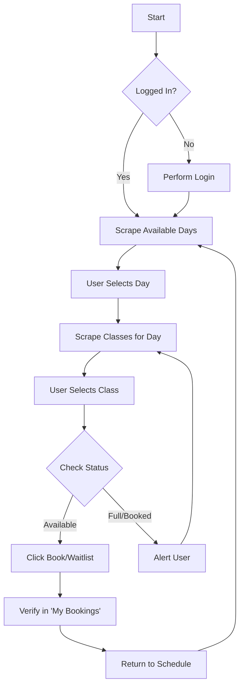

# Gym Booking Automation Bot


A CLI tool built with `Python` and `Selenium` to automate class bookings on the [App Brewery Gym](https://appbrewery.github.io/gym/) test site.

While designed for this demo, its architecture can be easily adapted for other reservation systems.

## Key Features

* **Interactive CLI:** Terminal interface to select days and classes.
* **Scraping:** Locates classes relative to specific day containers, ensuring accuracy even if the schedule layout changes.
* **Error Handling:** A custom `retry()` logic to handle network hiccups, stale elements, and loading timeouts.
* **Verification:** Automatically navigates to the "My Bookings" page after every action to confirm the booking was successful.
* **Multi-Browser Support:** Runs on Chrome or Firefox.

## Tech Stack

* **Language:** Python
* **Browser Automation:** Selenium WebDriver

## Automation Logic
The bot allows continuous booking without restarting the session.



## How to Run Locally

### 1. Clone the repository
```bash
git clone [https://github.com/yourusername/gym-booking-bot.git](https://github.com/yourusername/gym-booking-bot.git)
cd gym-booking-bot
```

### 2. Install Dependencies
```bash
pip install -r requirements.txt
```

### 3. Configure Environment Variables
1. Create a `.env` file in the project root (you can copy `.env.example`).
2. Add your account details:
```ini
# Account Credentials
ACCOUNT_EMAIL=student@test.com
ACCOUNT_PASSWORD=password123
GYM_URL=[https://appbrewery.github.io/gym/](https://appbrewery.github.io/gym/)

# Browser Settings
BROWSER=chrome
```

### 4. Run the Bot
```bash
python main.py
```